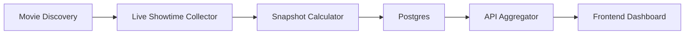

# Madanapalle BookMyShow Live Tracking Plan

## Goal

Build a Madanapalle-only website that works like BFilmy's BookMyShow live advance tracker:

- track all Madanapalle shows for a date
- show venue-wise and movie-wise sold seats
- show occupancy and gross
- keep updating until the BookMyShow cutoff window closes
- preserve final counts for reporting and charts

## Key Finding

BFilmy is not counting seats from the visible seat map in the browser.

From the live requests we traced, its frontend calls its own backend endpoints and receives show-level data that already contains:

- `VenueCode`
- `SessionId`
- `CutOffDateTime`
- category-wise `MaxSeats`
- category-wise `SeatsAvail`
- category-wise `CurPrice`

That is enough to calculate:

- total seats
- available seats
- sold seats
- occupancy
- gross

So the main plan is:

1. fetch live BookMyShow-style showtime payload
2. sum category counts
3. store snapshots
4. serve aggregated JSON to the frontend

Seat-layout scraping should be a fallback, not the primary path.

## Verified Live Facts

Verified on May 4, 2026:

- BFilmy's BookMyShow tracker page calls:
  - `flatmovies.json`
  - `cities.json`
  - `bms-india.vercel.app/api/showtimes`
  - fallback hosts `bms-india2.vercel.app` and `bms-india3.vercel.app`
- Madanapalle region code in the observed city mapping is `MDNP`
- BFilmy's cleaned output for `Kara (Telugu)` in Madanapalle shows per-show totals derived from live seat counts
- BookMyShow live pages expose the same data model on their own pages and client state

Verified Madanapalle theatre codes:

- `ASR A/C 4K Laser Dolby Surround 7.1: Madanapalle` -> `ASRM`
- `Siddartha Cinemas:Screen 2 Dolby Laser,Madanapalle` -> `MSDR`
- `Ravi A/C 4K Laser Dolby Surround 7.1: Madanapalle` -> `RTDM`
- `Sunil A/C 4K Laser Dolby Surround 7.1: Madanapalle` -> `SUTD`

Theatre still to confirm in build:

- `Sri Krishna A/C 4K Dolby Atmos: Madanapalle` -> code not yet confirmed in this research pass

Verified cutoff behavior:

- Siddartha sample show used `CutOffDateTime = show start + 30 min`
- ASR sample shows used `CutOffDateTime = show start + 15 min`

Current default rule set for phase 1:

- `Ravi` -> 15 min
- `ASR` -> 15 min
- `Sri Krishna` -> 15 min
- `Sunil` -> 15 min
- `Siddartha` -> 30 min

Important rule:

- always prefer live `CutOffDateTime` from BookMyShow
- only use theatre defaults when live cutoff is missing

## What We Should Build

### 1. Data Collector

The collector is the heart of the system.

Its job:

- discover which movies are active in `MDNP`
- fetch live showtime data for each movie and date
- compute sold seats from category-wise counts
- save snapshots repeatedly until cutoff

Preferred collection strategy:

- open the movie or theatre booking flow with a headless browser
- capture the BookMyShow showtime payload or client state
- extract:
  - `EventCode`
  - `VenueCode`
  - `SessionId`
  - `ShowDateTime`
  - `CutOffDateTime`
  - `Categories[].MaxSeats`
  - `Categories[].SeatsAvail`
  - `Categories[].CurPrice`

Fallback strategy:

- if city-wide movie data fails, open each theatre's `buytickets` page
- parse `window.__INITIAL_STATE__`
- aggregate venue-level shows into city totals

Last-resort fallback:

- open seat-layout flow and inspect accessible seat selection or seat-layout API path
- use this only when category counts are unavailable or inconsistent

## Counting Logic

For each show:

```text
total_seats = sum(category.MaxSeats)
available_seats = sum(category.SeatsAvail)
sold_seats = total_seats - available_seats
gross = sum((category.MaxSeats - category.SeatsAvail) * category.CurPrice)
occupancy_percent = sold_seats / total_seats * 100
```

For city or movie totals:

```text
total_sold = sum(show.sold_seats)
total_capacity = sum(show.total_seats)
total_gross = sum(show.gross)
overall_occupancy = total_sold / total_capacity * 100
```

This is the same model BFilmy appears to use.

## Architecture

Recommended stack:

- frontend: `Next.js`
- public API layer: `Next.js route handlers`
- collector worker: separate `Node.js + Playwright` service
- database: `Postgres`
- cache: database-first in phase 1, optional Redis later
- deployment:
  - frontend/API on `Vercel`
  - collector on `Railway`, `Fly.io`, or a small VPS

Why separate the collector:

- Playwright + retries + cookies + anti-bot handling are easier in a long-running worker
- serverless functions are not ideal for repeated polling close to showtime

## Data Flow



Detailed flow:

1. discovery job builds the list of active event codes for the target date
2. collector fetches Madanapalle live showtime payload per event
3. calculator converts category counts into sold, occupancy, and gross
4. snapshots are written to the database
5. API returns cached latest snapshot plus history
6. frontend renders live tables and charts

## Database Schema

### `cities`

- `id`
- `region_code` (`MDNP`)
- `name`
- `state`
- `active`

### `theatres`

- `id`
- `city_id`
- `name`
- `venue_code`
- `cutoff_rule_minutes`
- `active`

### `movies`

- `id`
- `event_code`
- `title`
- `language`
- `format`
- `poster_url`
- `censor`
- `duration_text`
- `release_date`
- `active`

### `shows`

- `id`
- `movie_id`
- `theatre_id`
- `show_date`
- `show_datetime`
- `session_id`
- `live_cutoff_at`
- `fallback_cutoff_at`
- `final_cutoff_at`
- `status`
- `last_seen_at`

### `show_categories`

- `id`
- `show_id`
- `price_desc`
- `price_code`
- `price`
- `max_seats`

### `seat_snapshots`

- `id`
- `show_id`
- `captured_at`
- `total_seats`
- `available_seats`
- `sold_seats`
- `gross`
- `occupancy_percent`
- `is_final_candidate`
- `source_type`
- `raw_payload_hash`

### `category_snapshots`

- `id`
- `seat_snapshot_id`
- `price_desc`
- `price`
- `max_seats`
- `available_seats`
- `sold_seats`

### `collector_runs`

- `id`
- `started_at`
- `finished_at`
- `target_date`
- `status`
- `movies_checked`
- `shows_checked`
- `errors_json`

## Polling Strategy

We do not need to hit every show every minute all day.

Recommended polling schedule:

- on discovery: poll every active movie every 30 minutes
- within 3 hours of show start: poll every 10 minutes
- within 60 minutes of show start: poll every 5 minutes
- from show start until cutoff minus 5 minutes: poll every 2 minutes
- final 5 minutes before cutoff: poll every 1 minute
- final lock snapshot: `final_cutoff_at - 1 minute`

If a show disappears early:

- keep the latest successful snapshot
- mark it as `final_by_disappearance = true`

## Madanapalle Phase 1 Configuration

Seed these theatres first:

- `ASRM` -> ASR
- `MSDR` -> Siddartha
- `RTDM` -> Ravi
- `SUTD` -> Sunil
- `Sri Krishna` -> add after venue code confirmation

Seed city:

- `MDNP` -> Madanapalle

Priority behavior:

- track today and tomorrow only in phase 1
- only keep live refresh for active shows
- preserve full snapshot history for analysis

## Backend API Design

### `GET /api/cities/mdnp/live?date=YYYY-MM-DD`

Returns:

- city summary
- theatre summary
- movie summary
- latest updated time

### `GET /api/movies/:eventCode/live?date=YYYY-MM-DD`

Returns:

- movie summary
- all Madanapalle shows
- sold, available, capacity, occupancy, gross

### `GET /api/shows/:showId/history`

Returns:

- full snapshot timeline for one show

### `GET /api/theatres/:venueCode/live?date=YYYY-MM-DD`

Returns:

- theatre summary
- all active shows in that theatre

### `GET /api/debug/raw-show/:showId`

Internal only:

- raw normalized payload used for calculation

## Frontend Pages

### Home

Show:

- today's Madanapalle summary
- total sold
- total capacity
- total occupancy
- total gross
- last updated time

### Movies Page

Show:

- all movies for the date
- total sold by movie
- shows count
- venues count
- gross

### Movie Detail Page

Show:

- each venue
- each show time
- sold
- capacity
- occupancy
- gross
- update time

### Theatre Page

Show:

- theatre total
- all shows
- booking velocity chart

### Show Detail Page

Show:

- snapshot timeline
- sold seats over time
- occupancy curve
- final locked count

## Build Order

### Phase 1

- set up Postgres schema
- seed Madanapalle city and theatres
- build one collector for a single event code
- confirm numbers match BookMyShow live counts

### Phase 2

- add movie discovery for `MDNP`
- add repeated polling
- add latest live API
- build minimal dashboard

### Phase 3

- add historical charts
- add retry logic and monitoring
- add final report export

### Phase 4

- add theatre-level filters
- add movie search
- add shareable links and image export

## Important Risks

### 1. Anti-bot protection

Direct `curl` access may get blocked even when browser sessions work.

So:

- use Playwright or browser-like sessions in the collector
- persist cookies where needed
- retry with backoff

### 2. Payload source changes

BookMyShow may move fields or rename client-state keys.

So:

- normalize raw payload into our own schema
- version the extractor logic

### 3. Temporary seat holds

Some unavailable seats may be blocked temporarily during checkout.

So:

- describe the metric as `sold / unavailable` internally until validated
- compare final numbers over time before claiming exact sales language everywhere

### 4. Theatre code drift

Venue identifiers and show schedules can change.

So:

- refresh theatre discovery daily
- store theatre metadata separately from show snapshots

## Recommended First Implementation

The fastest path to a working clone is:

1. build a collector for `eventCode + regionCode + dateCode`
2. extract category seat counts
3. compute sold totals
4. store snapshots
5. show Madanapalle dashboard

Do not start with seat-by-seat scraping.

Seat-by-seat scraping is heavier, more brittle, and not needed if category counts remain available.

## Immediate Next Step

Start by building a proof-of-concept collector for one movie in Madanapalle:

- target movie: `Kara (Telugu)` or any active title
- target city: `MDNP`
- output:
  - normalized JSON of all shows
  - computed sold totals
  - final API response shape

If that works, the rest of the site becomes straightforward.
